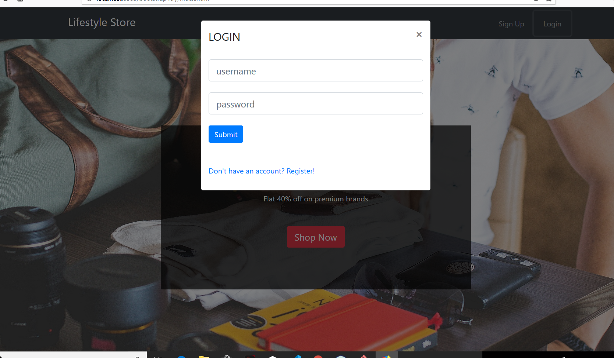
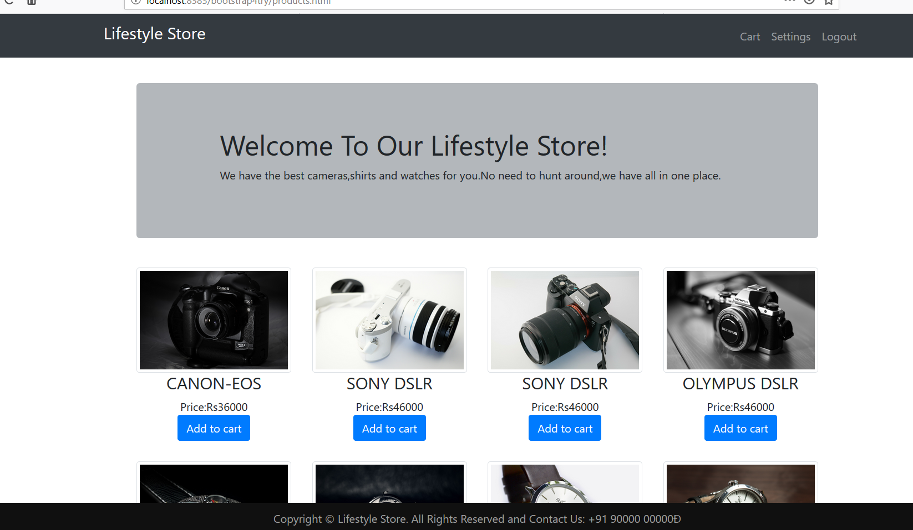

# Php-and-SQL-project
## This is an elegant and fully mobile-responsive ecommerce website made using php, sql and frontend technologies.

- store contains database files.
- User authentication is done using users email ad password.
- Php checks with sql database for the same and starts a session or gives error message.
- Following is the Layout of the site.

- Notice the change in nav bar after logging in.

